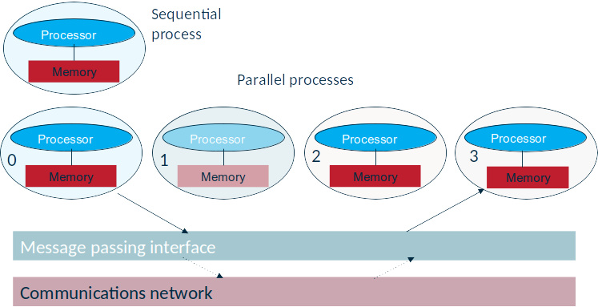

template: titleslide

# A brief introduction to HPC and parallel programming models
### Dmitry Nikolaenko, Sean Baccas
#### dmitry.nikolaenko@durham.ac.uk, sean.d.baccas@durham.ac.uk

---
# MPI: Message Passing Interface

.center[

]

