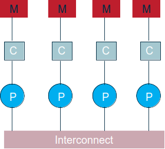
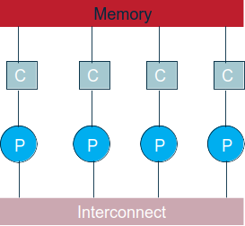
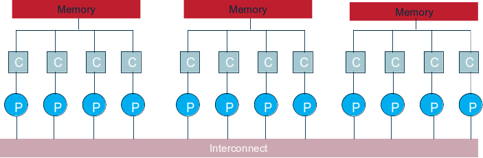
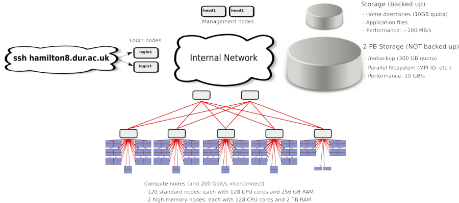
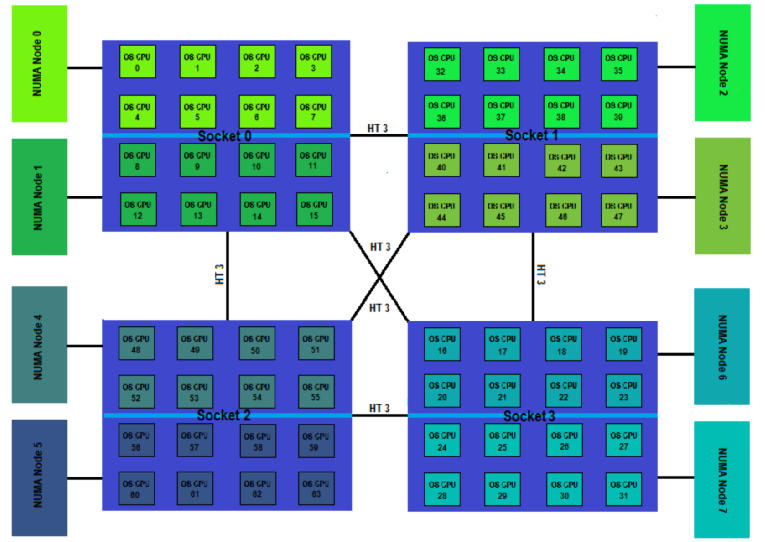

template: titleslide
# A brief introduction to parallel architectures
### Dmitry Nikolaenko, Sean Baccas
#### dmitry.nikolaenko@durham.ac.uk, sean.d.baccas@durham.ac.uk

---
# Distributed memory systems

.center[]

Distributed memory system e.g. Beowulf cluster. Architecture matches message passing paradigm.

.center[]

---
# Shared memory systems

.center[]

Shared-memory system, e.g., multiprocessor desktop PCs. Can use interconnect + memory as a communications network (the basis of mixed-mode parallelism)

.center[]

---
# Shared memory clusters

.center[]

Will use both memory/interconnect to communicate between processes. Commonly now found shared memory clusters (e.g., Hamilton!)

---
# Machine architecture: Hamilton

.center[]

Totals:
- 122 compute nodes
- 15,616 cores, 34T RAM
- 2 PB shared storage

---
# How to get to Hamilton

1. Option 1 - the standard way
    * ssh to Hamilton: `ssh <username>@hamilton8.dur.ac.uk`

2. Option 2 - the recommended way
    * Edit the configuration file at `$HOME/.ssh/config`
    * Add:
        ```console
        Host hamilton8
            HostName hamilton8.dur.ac.uk
            User <username>
            IdentityFile ~/.ssh/<path to your public ssh>
            ControlMaster auto
            ControlPath ~/.ssh/%r@%h:%p
        ```
    * Then you can ssh to Hamilton simply: `ssh hamilton8`

---
# How to copy files from and to Hamilton

If you configured SSH using the recommended way above, copying files to Hamilton works as follows:

```console
scp -r <filename> <username>@hamilton8
```

Copying files from Hamilton works in the same way, you only have to reverse the copy direction.

---
# The Slurm queuing system

To fairly share the available resources, Hamilton has a queueing system called _Slurm_.

> _Slurm_ is an open source, fault-tolerant, and highly scalable cluster management and job scheduling system for large and small Linux clusters. [Source](https://slurm.schedmd.com/quickstart.html)

A batch job is typically written on a login node and is submitted to Slurm from there. A job script file contains:

* instructions to Slurm describing the resources (CPU, memory, time, etc) needed for the job and any other Slurm settings
* the commands the job will run, in sequence

Here's an example job script `job.sh`:

```shell
#!/bin/bash
#SBATCH --job-name="my-first-script"
#SBATCH -o myscript.%A.out
#SBATCH -e myscript.%A.err
#SBATCH -p test.q
#SBATCH -t 00:05:00
#SBATCH -N 1 # number of nodes
#SBATCH -n 4 # number of tasks (MPI ranks)
#SBATCH -c 4 # number of cores per task

module purge
module load intel/2021.4
module load intelmpi/2021.6
mpirun ./myprogram
```

---
# Slurm job script options

| Option      | Description |
| ----------- | ----------- |
| `-p <QUEUE>`| Submit job to `<QUEUE>` (queues are also known as partitions) |
| `-t <TIME>` | Run job for a maximum time of `<TIME>`, in the format dd-hh:mm:ss |
| `-c <CORES>`| For multi-core jobs: allocate `<CORES>` CPU cores to the job |
| `-n <CORES>`| For MPI jobs: allocate `<CORES>` CPU cores to the job |
| `-N <NODES>`| Allocate `<NODES>` compute nodes to the job |
| `--mem=<MEM>`| Allocate `<MEM>` RAM to the job, e.g. 1G|
| `--gres=tmp:<TMPSPACE>`| Allocate `<TMPSPACE>` temporary disk space on the compute node(s)|
| `--array=<START>-<END>`| Run job several times, from indexes `<START>` to `<END>`|
| `--mail-user=<EMAIL>`| Send job notifications to email address `<EMAIL>` (for batch jobs only; not needed to send to submitter's Durham address)|
| `--mail-type=<TYPE>`| Types of job notifications to send, e.g. `BEGIN`, `END`, `FAIL`, `ALL` (recommended: `END`,`FAIL`).  For batch jobs only.|

---
# Non-Uniform Memory Access Architecture

> **Non-uniform memory access (NUMA)** is a computer memory design used in multiprocessing, where the memory access time depends on the memory location relative to the processor. Under NUMA, a processor can access its own local memory faster than non-local memory (memory local to another processor or memory shared between processors) [Wikipedia](https://en.wikipedia.org/wiki/Non-uniform_memory_access)

.center[]

---
# ASCII representation 🙂

```console

+--------------------------+   +--------------------------+
| Socket 1                 |   | Socket 2                 |
|                          |   |                          |
| +----------------------+ |   | +----------------------+ |
| |  Core 0              | |   | |  Core 0              | |
| | +------------------+ | |   | | +------------------+ | |
| | | Thread 0 (cpu0)  | | |   | | | Thread 0 (cpu15) | | |
| | +------------------+ | |   | | +------------------+ | |
| | | Thread 1 (cpu1)  | | |   | | | Thread 1 (cpu16) | | |
| | +------------------+ | |   | | +------------------+ | |
| +----------------------+ |   | +----------------------+ |
|                          |   |                          |
| +----------------------+ |   | +----------------------+ |
| |  Core 1              | |   | |  Core 1              | |
| | +------------------+ | |   | | +------------------+ | |
| | | Thread 0 (cpu2)  | | |   | | | Thread 0 (cpu17) | | |
| | +------------------+ | |   | | +------------------+ | |
| | | Thread 1 (cpu3)  | | |   | | | Thread 1 (cpu18) | | |
| | +------------------+ | |   | | +------------------+ | |
| +----------------------+ |   | +----------------------+ |
|                          |   |                          |
|                          |   |                          |
  .... more cores .....          .... more cores .....
|                          |   |                          |
| +----------------------+ |   | +----------------------+ |
| |  Core 6              | |   | |  Core 6              | |
| | +------------------+ | |   | | +------------------+ | |
| | | Thread 0 (cpu12) | | |   | | | Thread 0 (cpu26) | | |
| | +------------------+ | |   | | +------------------+ | |
| | | Thread 1 (cpu13) | | |   | | | Thread 1 (cpu27) | | |
| | +------------------+ | |   | | +------------------+ | |
| +----------------------+ |   | +----------------------+ |
|                          |   |                          |
| +----------------------+ |   | +----------------------+ |
| |  Core 7              | |   | |  Core 7              | |
| | +------------------+ | |   | | +------------------+ | |
| | | Thread 0 (cpu28) | | |   | | | Thread 0 (cpu42) | | |
| | +------------------+ | |   | | +------------------+ | |
| | | Thread 1 (cpu29) | | |   | | | Thread 1 (cpu43) | | |
| | +------------------+ | |   | | +------------------+ | |
| +----------------------+ |   | +----------------------+ |
|                          |   |                          |
  .... more cores .....          .... more cores .....
|                          |   |                          |
| +----------------------+ |   | +----------------------+ |
| |  Core 14             | |   | |  Core 14             | |
| | +------------------+ | |   | | +------------------+ | |
| | | Thread 0 (cpu40) | | |   | | | Thread 0 (cpu54) | | |
| | +------------------+ | |   | | +------------------+ | |
| | | Thread 1 (cpu41) | | |   | | | Thread 1 (cpu55) | | |
| | +------------------+ | |   | | +------------------+ | |
| +----------------------+ |   | +----------------------+ |
|                          |   |                          |
+--------------------------+   +--------------------------+
```

---
# NUMA on Hamilton

`lscpu` is a utility for getting detailed information about the CPU (Central Processing Unit) configuration of the system.

```console
lcgk69@login1:~$ lscpu
Architecture:        x86_64
CPU op-mode(s):      32-bit, 64-bit
Byte Order:          Little Endian
CPU(s):              128
On-line CPU(s) list: 0-127
Thread(s) per core:  1
Core(s) per socket:  64
Socket(s):           2
NUMA node(s):        8
Vendor ID:           AuthenticAMD
CPU family:          23
Model:               49
Model name:          AMD EPYC 7702 64-Core Processor
Stepping:            0
CPU MHz:             1996.237
BogoMIPS:            3992.47
Virtualization:      AMD-V
L1d cache:           32K
L1i cache:           32K
L2 cache:            512K
L3 cache:            16384K
NUMA node0 CPU(s):   0-15
NUMA node1 CPU(s):   16-31
NUMA node2 CPU(s):   32-47
NUMA node3 CPU(s):   48-63
NUMA node4 CPU(s):   64-79
NUMA node5 CPU(s):   80-95
NUMA node6 CPU(s):   96-111
NUMA node7 CPU(s):   112-127
```

---
# What are nodes, sockets, cores, threads (still confused)? 🤔

* `Sockets` represents how many physical CPUs are in the system.
* `Cores per socket` is how many full CPU cores (including loading/decoding logic) there are per physical CPU.
* `Threads per core` is how many threads can be scheduled on a single core (HyperThreading).
* `CPU` means "schedulable entities", this is how many run queues the operating system will have, so that would be `sockets x cores per socket x threads per core`.

In our example, the number of `CPUs` displayed is `2x64x1 = 128`.
